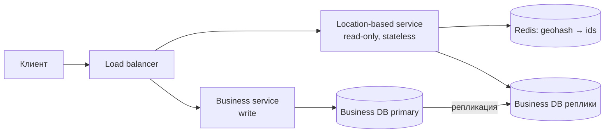

# Глава 1. Proximity Service

> **Статус:** 🟨 конспект (по памяти, сверь цифры с книгой)  
> 🎮 [Симулятор этой главы](../../simulator/index.html#ch1) (открой файл в браузере или через GitHub Pages)

## 🎯 Одной фразой
Сервис «что рядом со мной»: по координатам пользователя и радиусу быстро вернуть рестораны, отели и другие места (как Yelp или «Рядом» в картах).

## 🧭 Карта решения
Требования → оценка (**читают намного больше, чем пишут**) → API → выбор **алгоритма гео-поиска** (главное решение главы) → архитектура (LBS читает, Business service пишет) → кэш и реплики → масштабирование

**Сюжет главы:** данные почти статичны и читаются очень часто, поэтому всё упирается в способ быстро найти места в радиусе. Ответ: превратить «двумерный» поиск в «одномерный» через geohash или дерево (quadtree), а остальное решают кэш и реплики.

## 1. Требования
- **Функциональные:** вернуть места в радиусе (0.5 / 1 / 2 / 5 / 20 км) от пользователя; владелец добавляет, меняет и удаляет бизнес; пользователь смотрит карточку места.
- **Нефункциональные:** низкая задержка поиска, высокая доступность, масштабируемость в часы пик.
- **Упрощение:** изменения бизнеса могут попадать в поиск **не сразу** (хватит обновления на следующий день). Это сильно упрощает кэширование.

## 2. Оценка нагрузки
100 млн DAU, 200 млн бизнесов, ~5 поисков на пользователя в день → ≈ 5 тыс. QPS.  
**Вывод:** нагрузка **read-heavy**, запись редкая. Значит, выгодны реплики на чтение и кэш, а запись можно не оптимизировать.

## 3. API и данные
- `GET /v1/search/nearby?latitude&longitude&radius` → список мест с id и краткой информацией.
- CRUD по бизнесу: `/v1/businesses/{id}`.
- Таблицы: `business` (данные места) и **гео-индекс** (ячейка → список `business_id`).

## 4. Архитектура

Читающий LBS и пишущий Business service разделены, потому что их нагрузка различается на порядки и масштабируются они независимо.

## 5. Путь решения: проблема → решение → эффект

### Шаг 1. Как искать места в радиусе
- **🔴 Проблема:** наивный запрос `WHERE lat BETWEEN … AND lon BETWEEN …` ищет по двум диапазонам. Индекс по каждому полю возвращает огромные списки, которые потом пересекаются: медленно на 200 млн записей.
- **🟢 Решение:** свести двумерный поиск к одномерному через **geohash** (строка-код ячейки) или **quadtree** (дерево).
- **📈 Что улучшилось:** скорость поиска, ведь вместо пересечения диапазонов один поиск по ключу или по дереву.
- **⚖️ Цена:** появляются граничные случаи и дополнительная структура данных.
- **🔀 Альтернативы:** равномерная сетка (плохо при неравномерной плотности), Google S2 / Hilbert curve (мощнее, но сложнее).
- **🗣️ Для интервью:** «Двумерный поиск превращаем в одномерный: geohash для простоты, quadtree если нужна адаптация к плотности».

### Шаг 2. Geohash и его подводные камни
- **🔴 Проблема:** две точки рядом могут оказаться по разные стороны границы ячейки и иметь разные префиксы. Ячейка может быть слишком большой или пустой.
- **🟢 Решение:** длину geohash подбираем под радиус (длиннее значит мельче ячейка), ищем **в своей ячейке и 8 соседних**, затем фильтруем по точному расстоянию. Если результатов мало, укорачиваем geohash и расширяем область.
- **📈 Что улучшилось:** полнота результатов без больших затрат.
- **⚖️ Цена:** запрос идёт в 9 ячеек, а не в одну. Ячейки одинакового размера не подстраиваются под плотность.
- **🗣️ Для интервью:** «Geohash легко обновлять и реализовать, но надо искать в соседних ячейках из-за границ».

### Шаг 3. Quadtree как альтернатива
- **🔴 Проблема:** в центре города тысячи мест на ячейку, за городом ничего. Geohash этого не учитывает.
- **🟢 Решение:** дерево, где ячейку делят на 4, пока в ней больше ~100 мест. Хранится в памяти LBS.
- **📈 Что улучшилось:** адаптивность к плотности, быстрый поиск k ближайших.
- **⚖️ Цена:** дерево строится на старте (минуты на сотнях миллионов точек), занимает память, обновление сложнее; перезапускать серверы надо постепенно.
- **🔀 Выбор:** geohash проще эксплуатировать, quadtree хорош для плотности и k ближайших.

### Шаг 4. Кэш и реплики
- **🔴 Проблема:** 5 тыс. QPS и «горячие» центры городов бьют по БД.
- **🟢 Решение:** Redis хранит `geohash → [business_id]` и карточки мест; БД бизнесов с репликами на чтение.
- **📈 Что улучшилось:** нагрузка на БД, задержка. Гео-индекс небольшой (порядка нескольких ГБ), поэтому его можно реплицировать, а не шардировать.
- **⚖️ Цена:** TTL и инвалидация, но благодаря «обновляем на следующий день» это просто.
- **🗣️ Для интервью:** «Данные меняются редко, поэтому агрессивный кэш и реплики решают нагрузку».

### Шаг 5. Шардировать ли Business DB?
- **🔴 Проблема:** вдруг данных слишком много.
- **🟢 Решение:** сначала **посчитать**: 200 млн × ~1 КБ ≈ 200 ГБ. Помещается на одной машине.
- **📈 Эффект:** не строим лишнего. Реплики дешевле шардов.
- **🗣️ Для интервью:** «Сначала оцениваю объём, шардирование только если действительно не помещается».

## 6. Паттерны
Геопоиск (geohash, quadtree) · Кэширование · Реплики на чтение · Разделение read/write сервисов

## 7. Вопросы для повторения

Почему обычный SQL по lat/lon плох?

Два диапазонных индекса возвращают огромные множества, пересечение которых дорого.

Какая проблема у geohash на границах и как её решают?

Близкие точки могут иметь разные префиксы. Ищем в своей и 8 соседних ячейках, потом фильтруем по реальному расстоянию.

Чем quadtree лучше и хуже geohash?

Лучше: адаптация к плотности, k ближайших. Хуже: построение на старте, память, сложнее обновлять.

Зачем разделять LBS и Business service?

Чтение и запись различаются по нагрузке на порядки: масштабируем независимо.

Почему не нужно шардировать гео-индекс?

Он небольшой (несколько ГБ), поэтому реплицируем для QPS и отказоустойчивости.

## 8. Мои заметки
- …
