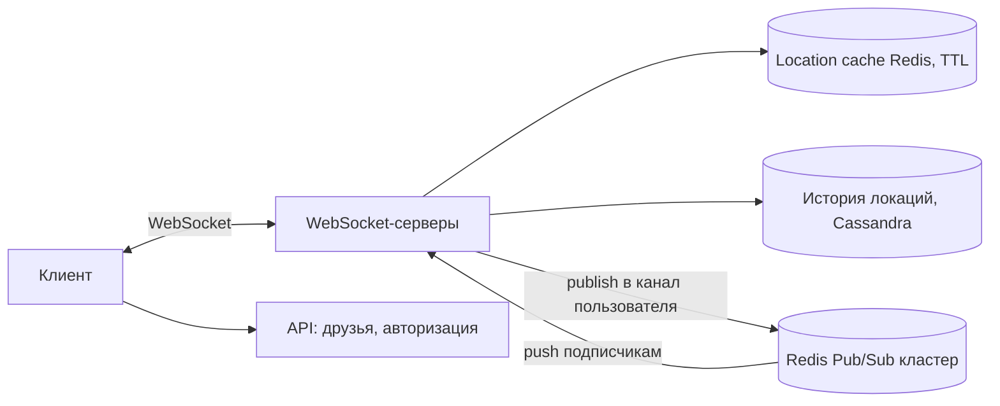
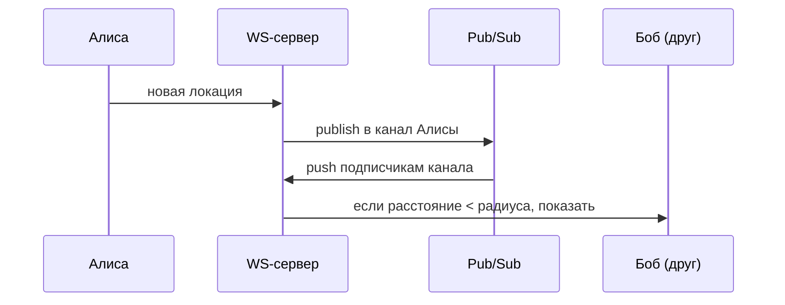

# Глава 2. Nearby Friends

> **Статус:** 🟨 конспект (по памяти, сверь цифры с книгой)  
> 🎮 [Симулятор этой главы](../../simulator/index.html#ch2)

## 🎯 Одной фразой
Показываем пользователю друзей поблизости и обновляем их положение почти в реальном времени, пока приложение открыто.

## 🧭 Карта решения
Требования → оценка (**один апдейт превращается в десятки доставок**) → WebSocket → **Redis Pub/Sub** вместо опроса БД → кэш последней локации + история → **масштабирование stateful-слоёв** (WS и Pub/Sub)

**Сюжет главы:** задача не в хранении, а в **fan-out**: каждый апдейт локации надо доставить всем «подходящим» друзьям. Pub/Sub отлично подходит, но он stateful, поэтому масштабирование становится главной болью.

## 1. Требования
- **Функциональные:** список друзей рядом (радиус задан), периодическое обновление, у каждого друга расстояние и время обновления.
- **Нефункциональные:** низкая задержка доставки; **допустима потеря отдельного обновления** (следующее придёт через ~30 с); надёжность не критична, но система не должна падать.

## 2. Оценка нагрузки
10 млн одновременных пользователей, обновление раз в 30 с → ≈ **334 тыс. обновлений в секунду**. У пользователя ~400 друзей, ~10% из них онлайн и рядом → ≈ 40 доставок на апдейт → **≈ 14 млн доставок в секунду**.  
**Вывод:** нагрузка определяется не входящим потоком, а **исходящим fan-out**. Один Redis держит порядка 100 тыс. push/с, то есть нужна сотня с лишним серверов.

## 3. Архитектура

## 4. Путь решения: проблема → решение → эффект

### Шаг 1. Как доставить обновление друзьям
- **🔴 Проблема:** если каждый клиент опрашивает БД про друзей, получаем сотни миллионов чтений в секунду, к тому же с задержкой.
- **🟢 Решение:** **WebSocket** для двусторонней связи и **Redis Pub/Sub**: у каждого пользователя свой канал, друзья подписаны на него. Апдейт публикуется один раз, а доставка идёт «толчком».
- **📈 Что улучшилось:** задержка и нагрузка на БД: данные идут через память.
- **⚖️ Цена:** Pub/Sub не хранит сообщения (потеряли значит потеряли), нужна подписка на каналы всех друзей.
- **🗣️ Для интервью:** «Pub/Sub отдаёт обновление всем подписанным друзьям мгновенно, а потеря одного апдейта не критична».

### Шаг 2. Последняя локация и история
- **🔴 Проблема:** при открытии приложения надо сразу показать друзей, а писать 300+ тыс. раз в секунду в Postgres нельзя.
- **🟢 Решение:** **Redis с TTL** хранит последнюю локацию (нет апдейта, значит пользователь «выпал»). История идёт **асинхронно** в Cassandra.
- **📈 Эффект:** быстрый старт и нагрузка записи ушла из основного пути.
- **⚖️ Цена:** две дополнительные системы, данные в памяти.

### Шаг 3. Снижаем fan-out
- **🔴 Проблема:** 14 млн доставок в секунду это дорого.
- **🟢 Решение:** присылать обновление, только если пользователь заметно сдвинулся; ограничить рассылку друзьям рядом/онлайн.
- **📈 Эффект:** самый дешёвый способ снизить нагрузку: не делать лишнюю работу.
- **⚖️ Цена:** менее плавные обновления.

### Шаг 4. Масштабирование Pub/Sub и WebSocket
- **🔴 Проблема:** оба слоя **stateful**. WS держит соединения, Pub/Sub помнит подписки. Просто добавить сервер нельзя.
- **🟢 Решение:** WS-серверы выключаем через **graceful drain** (перестаём принимать новых, ждём переподключения). Каналы распределяем по Pub/Sub-серверам через **consistent hashing**, карту хранит service discovery (etcd/ZooKeeper).
- **📈 Эффект:** горизонтальное масштабирование без лавины переподключений.
- **⚖️ Цена:** при изменении кластера Pub/Sub часть клиентов надо переподписать; делать это заранее и в тихие часы. Операционно сложно.
- **🗣️ Для интервью:** «Stateful слои масштабируем осторожно: drain для WS и hash ring + service discovery для Pub/Sub».

## 5. Паттерны
Pub/Sub · Fan-out · WebSocket · Consistent hashing · Service discovery · Кэш с TTL

## 6. Вопросы для повторения

Почему нагрузка определяется fan-out, а не входящим потоком?

Один апдейт превращается в десятки доставок: 334 тыс./с × ~40 ≈ 14 млн/с.

Почему допустима потеря сообщения в Pub/Sub?

Следующее обновление придёт через 30 с и перекроет потерянное: данные эфемерные.

Зачем location cache с TTL?

Быстро отдать последнюю точку друзей при подключении; неактивные пропадают сами.

Что сложного в масштабировании Pub/Sub-кластера?

Он stateful: при смене числа серверов каналы переезжают, клиентов надо переподписать. Помогают consistent hashing и service discovery.

## 7. Мои заметки
- …
