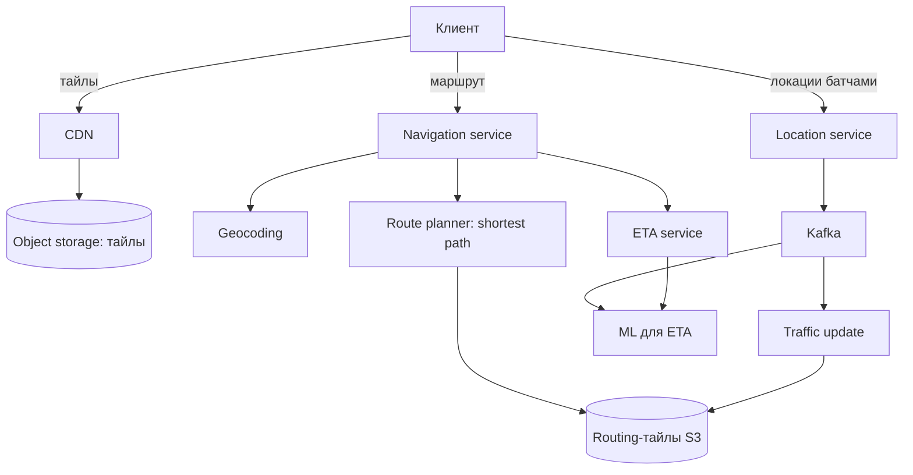

# Глава 3. Google Maps

> **Статус:** 🟨 конспект (по памяти, сверь цифры с книгой)  
> 🎮 [Симулятор этой главы](../../simulator/index.html#ch3)

## 🎯 Одной фразой
Три подсистемы в одной: **показ карты** (тайлы), **построение маршрута и ETA** и **сбор локаций** пользователей для актуальных пробок.

## 🧭 Карта решения
Требования → три потока нагрузки → **тайлы** (предрасчёт + CDN + векторные) → **маршруты** (граф на тайлах, иерархия) → **ETA и пробки** (поток локаций) → доставка обновлений

**Сюжет главы:** у каждой подсистемы свой профиль. Карта почти статична, поэтому её **считаем заранее и раздаём из кэша**. Маршрут слишком тяжёл для обхода всего графа, поэтому **делим граф на иерархические тайлы**. Пробки меняются каждую минуту, поэтому нужен **потоковый конвейер**.

## 1. Требования
- **Функциональные:** определение положения, навигация (маршрут + ETA), отображение карты.
- **Нефункциональные:** плавность отображения, точность, экономия трафика и батареи клиента.

## 2. Оценка (качественно)
Тайлы дают **миллионы запросов в секунду и гигантский трафик**, маршрутов на порядки меньше, но каждый тяжёлый. Поток локаций от навигирующих это постоянная запись.  
**Вывод:** тайлы решаются кэшированием и CDN, маршруты алгоритмически, локации потоковой обработкой.

## 3. Архитектура

## 4. Путь решения: проблема → решение → эффект

### Шаг 1. Как показывать карту
- **🔴 Проблема:** рисовать карту под каждый запрос слишком дорого, а запросов миллионы в секунду.
- **🟢 Решение:** **предрасчитанные тайлы** на всех уровнях zoom (~21), лежат в объектном хранилище; клиент по координатам и zoom сам считает URL тайла и тянет статику через **CDN**.
- **📈 Что улучшилось:** нагрузка и задержка: раздача статики на порядки дешевле рендера.
- **⚖️ Цена:** огромный объём хранения (на каждом уровне плиток в 4 раза больше), обновление карты требует пересчёта плиток.
- **🗣️ Для интервью:** «Карта почти статична, поэтому один раз считаем и раздаём из CDN».

### Шаг 2. Экономим трафик: векторные тайлы
- **🔴 Проблема:** растровые тайлы тяжёлые, а при смене масштаба картинка «прыгает».
- **🟢 Решение:** **векторные тайлы**: отдаём геометрию и стили, клиент рисует через WebGL.
- **📈 Эффект:** трафик в разы меньше, плавное масштабирование.
- **⚖️ Цена:** нагрузка на устройство и необходимость WebGL.

### Шаг 3. Как строить маршрут по графу всего мира
- **🔴 Проблема:** Dijkstra по всему графу дорог слишком медленный и не помещается в память.
- **🟢 Решение:** граф дорог **нарезан на routing-тайлы** трёх уровней (локальные, магистральные, скоростные), лежат в хранилище и **подгружаются лениво**; поиск (A*/Dijkstra) поднимается на крупные дороги для дальних маршрутов. Тайлы готовит офлайн-конвейер из данных о дорогах.
- **📈 Эффект:** скорость и память: не обходим весь мир, не держим весь граф сразу.
- **⚖️ Цена:** конвейер подготовки, сложнее отладка маршрутов, важен кэш горячих тайлов.
- **🗣️ Для интервью:** «Иерархия как у людей: по городу локально, между городами по магистралям».

### Шаг 4. Пробки и точное ETA
- **🔴 Проблема:** по «идеальным» скоростям ETA врёт при пробках.
- **🟢 Решение:** клиенты **батчами** шлют локации (меньше запросов и батареи) → **Kafka** → потоковая обработка вычисляет реальную скорость на участках, обновляет routing-тайлы и данные для ML-модели ETA.
- **📈 Эффект:** актуальный маршрут и ETA.
- **⚖️ Цена:** сложный stream/ML-конвейер, потребители должны быть идемпотентны (at-least-once).
- **🔀 Адаптивный ETA:** при изменении трафика пользователя можно вести по новому маршруту.

## 5. Паттерны
Предрасчёт + CDN · Иерархическое разбиение графа · Ленивая загрузка · Потоковая обработка (Kafka) · Батчинг на клиенте

## 6. Вопросы для повторения

Почему тайлы предрасчитываем, а не рисуем на лету?

Карта почти статична, а запросов миллионы в секунду: раздача статики из CDN на порядки дешевле.

Зачем иерархические routing-тайлы?

Граф мира слишком велик для памяти и полного обхода: для дальних маршрутов ищем по крупным дорогам, мелкие тайлы грузим лениво.

Зачем Kafka для локаций?

Поток читают несколько потребителей: пробки, обновление routing-тайлов, ML для ETA, аналитика.

Почему клиент батчит локации?

Меньше запросов к серверу и расход батареи за счёт небольшой задержки.

## 7. Мои заметки
- …
