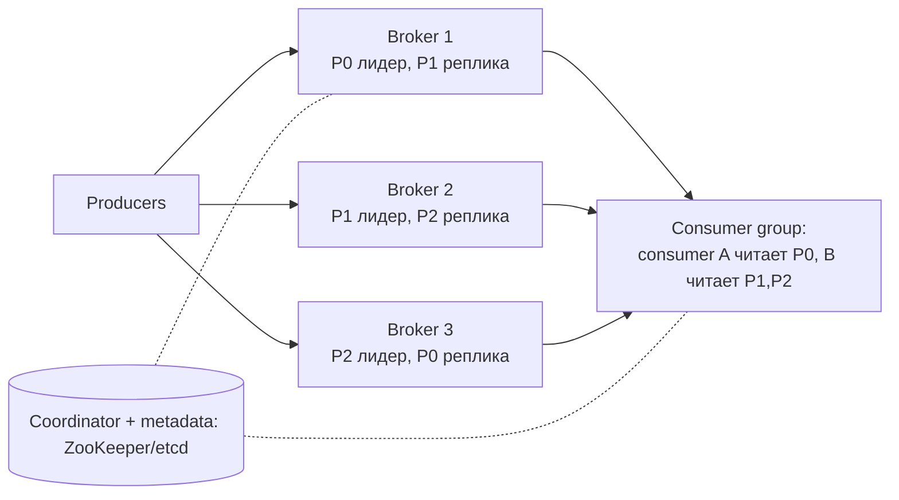

# Глава 4. Distributed Message Queue

> **Статус:** 🟨 конспект (по памяти, сверь цифры с книгой)  
> 🎮 [Симулятор этой главы](../../simulator/index.html#ch4)

## 🎯 Одной фразой
Проектируем очередь сообщений уровня Kafka: производители пишут, потребители читают, система не теряет данные и масштабируется по пропускной способности.

## 🧭 Карта решения
Требования → почему не очередь на БД → **append-only лог (WAL)** → **топики и партиции** → **consumer groups + offset + координатор** → **батчинг** → **репликация (ISR)** → семантики доставки

**Сюжет главы:** каждый шаг ответ на ограничение предыдущего. Лог быстр, но одна машина, значит партиции. Партиции есть, но кто читает какую, значит consumer groups и координатор. Машины падают, значит репликация, а она замедляет, значит настраиваем acks.

## 1. Требования
- Producers пишут, consumers читают; сообщение можно прочитать повторно (в отличие от классической очереди).
- **Порядок** внутри партиции; хранение до ~2 недель.
- Настраиваемая семантика доставки: **at-most-once / at-least-once / exactly-once**.
- Настраиваемый баланс: **высокий throughput** (батчи) или **низкая задержка**.

## 2. Архитектура

## 3. Путь решения: проблема → решение → эффект

### Шаг 1. Где хранить сообщения
- **🔴 Проблема:** очередь поверх БД (INSERT и SELECT FOR UPDATE) упирается в блокировки и случайный I/O. Тысячи сообщений в секунду уже предел.
- **🟢 Решение:** **append-only лог (WAL)**: сообщения только дописываются в конец сегмента, читаются последовательно по offset. Старые сегменты удаляются целиком по retention.
- **📈 Что улучшилось:** пропускная способность на порядки: последовательный диск и кэш страниц ОС быстрее случайного доступа.
- **⚖️ Цена:** нет сложных запросов, только чтение с позиции.
- **🗣️ Для интервью:** «Лог на диске быстрее, потому что пишем и читаем последовательно».

### Шаг 2. Одна машина не вытянет: партиции
- **🔴 Проблема:** один лог лежит на одной машине, масштабировать некуда.
- **🟢 Решение:** топик делится на **партиции**, каждая лог на своём брокере. Сообщения с одним ключом попадают в одну партицию.
- **📈 Эффект:** запись и чтение масштабируются горизонтально.
- **⚖️ Цена:** порядок гарантирован **только внутри партиции**; «горячие» ключи перегружают одну партицию; уменьшить число партиций трудно.

### Шаг 3. Кто какую партицию читает
- **🔴 Проблема:** несколько consumers одной задачи не должны читать одно и то же и не должны мешать друг другу.
- **🟢 Решение:** **consumer group**. Каждая партиция читается одним consumer-ом группы. **Offset** запоминает позицию. **Координатор** отслеживает участников (heartbeat) и перераспределяет партиции (**rebalance**).
- **📈 Эффект:** параллельное чтение без дублей, разные группы читают независимо.
- **⚖️ Цена:** consumers ≤ партиций (лишние простаивают), rebalance временно останавливает чтение.
- **🗣️ Для интервью:** «Партиция читается одним consumer-ом в группе, поэтому параллелизм ограничен числом партиций».

### Шаг 4. Throughput против latency: батчинг
- **🔴 Проблема:** каждое сообщение отдельным вызовом дорого.
- **🟢 Решение:** **батчи** на producer, брокере и consumer; zero-copy чтение.
- **📈 Эффект:** throughput в разы выше.
- **⚖️ Цена:** растёт задержка (ждём заполнения пачки) и риск потерять буфер при падении клиента. Это ручка настройки.

### Шаг 5. Брокеры падают: репликация
- **🔴 Проблема:** падение брокера означает потерю партиции.
- **🟢 Решение:** у партиции **лидер и фолловеры** на разных брокерах; **ISR** набор реплик, успевающих за лидером. Настройка **acks**: 0 (не ждём), 1 (лидер), all (все ISR).
- **📈 Эффект:** отказоустойчивость и сохранность данных; при падении лидера выбирается реплика из ISR.
- **⚖️ Цена:** диск ×3, сеть, запись медленнее. acks=all надёжнее, но задержка выше.

### Шаг 6. Семантики доставки
- **At-most-once:** commit offset до обработки (возможна потеря).
- **At-least-once:** commit после обработки (возможны дубли, значит consumer идемпотентный).
- **Exactly-once:** идемпотентный producer + транзакции/атомарный commit; самый дорогой вариант.

## 4. Паттерны
Append-only log · Партиционирование · Consumer groups · Репликация leader/follower · Батчинг · Идемпотентность

## 5. Вопросы для повторения

Почему лог на диске быстрее БД для очереди?

Последовательный I/O и кэш страниц ОС; нет блокировок и случайных записей.

Почему порядок гарантируется только внутри партиции?

Разные партиции лежат на разных брокерах и пишутся независимо.

Почему consumers в группе не больше партиций?

Партицию читает ровно один consumer группы: лишние простаивают.

Что такое ISR и acks=all?

ISR реплики, успевающие за лидером. acks=all значит запись подтверждена всеми ISR: надёжнее, но дольше.

Как получить at-least-once и что с дублями?

Commit offset после обработки. Дубли возможны, поэтому обработка должна быть идемпотентной.

## 6. Мои заметки
- …
