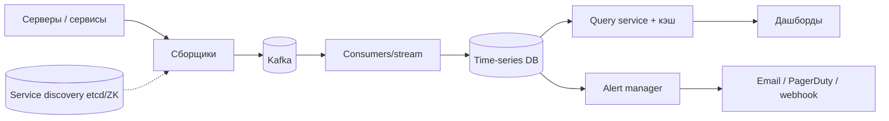

# Глава 5. Metrics Monitoring and Alerting

> **Статус:** 🟨 конспект (по памяти, сверь цифры с книгой)  
> 🎮 [Симулятор этой главы](../../simulator/index.html#ch5)

## 🎯 Одной фразой
Система, которая собирает метрики с тысяч серверов, хранит их, рисует дашборды и вовремя отправляет алерты.

## 🧭 Карта решения
Требования → оценка (**запись постоянная и огромная, чтение «пилой»**) → модель данных (time series) → **сбор: pull или push** → **Kafka-буфер** → **TSDB** → оптимизация места (сжатие, downsampling) → запросы и кэш → **alert manager**

**Сюжет главы:** это write-heavy система. Поэтому берём специализированную **TSDB**, ставим **буфер** от всплесков и экономим место, ведь метрики однотипны и со временем теряют детальность.

## 1. Требования и оценка
- ~1000 пулов серверов × 100 машин × 100 метрик ≈ **10 млн метрик**; хранить ~1 год; сырые 7 дней, затем 1 мин, затем 1 час.
- Нужны: сбор, хранение, алерты, визуализация.
- **Вывод:** запись постоянная и большая, чтение редкое, но скачками (дашборды, алерты). Данные только дописываем.

## 2. Модель данных
Time series: имя метрики + теги (labels, например `host=web-1`) + пары (время, значение). Запросы почти всегда «за период с агрегацией».

## 3. Архитектура

## 4. Путь решения: проблема → решение → эффект

### Шаг 1. Где хранить
- **🔴 Проблема:** реляционная таблица раздувается индексами и строчным хранением, запись тормозит, диск растёт слишком быстро.
- **🟢 Решение:** **time-series DB** (InfluxDB, Prometheus-подобные): оптимизирована под постоянную запись и агрегации по времени.
- **📈 Эффект:** выше скорость записи и запросов, компактнее хранение.
- **⚖️ Цена:** специфичный язык запросов, **кардинальность тегов** (слишком много уникальных значений раздувает индекс).
- **🗣️ Для интервью:** «Метрики это time series: реляционная БД не подходит по записи и по объёму».

### Шаг 2. Как собирать: pull или push
- **Pull (как Prometheus):** сборщики сами опрашивают сервисы. Список целей из **service discovery** (etcd/ZooKeeper), цели между сборщиками делит **consistent hashing**. Плюс: легко понять, жив ли сервис, нет агентов. Минус: нужен сетевой доступ, плохо для эфемерных задач.
- **Push:** агент на машине шлёт данные на сборщики за балансировщиком; сборщики stateless и легко автомасштабируются. Плюс: подходит для эфемерных задач. Минус: надо ставить и обновлять агентов, сложнее проверять «жив ли сервис».
- **🗣️ Для интервью:** «Выбор зависит от среды. Важно назвать компромиссы обоих».

### Шаг 3. Всплески записи
- **🔴 Проблема:** пики и сбои базы ведут к потере метрик.
- **🟢 Решение:** **Kafka** между сборщиками и хранилищем.
- **📈 Эффект:** хранилище видит ровный поток; при сбое данные не теряются, их можно перечитать.
- **⚖️ Цена:** лишний компонент и задержка.

### Шаг 4. Диск растёт
- **🔴 Проблема:** метрики за год это десятки и сотни ТБ.
- **🟢 Решение:** **сжатие** (delta-of-delta, XOR: соседние значения почти не меняются) и **downsampling** (7 дней сырые, 30 дней по минуте, дальше по часу), холодное хранение старого.
- **📈 Эффект:** в разы меньше диск.
- **⚖️ Цена:** downsampling сглаживает старые пики; выбирать агрегаты (avg, max, p99) осознанно.

### Шаг 5. Быстрые дашборды
- **🔴 Проблема:** одинаковые тяжёлые запросы повторяются многими пользователями.
- **🟢 Решение:** **query service с кэшем** результатов (короткий TTL). Агрегацию можно делать на сборе, при записи или при запросе.
- **⚖️ Цена:** слегка устаревшие графики.

### Шаг 6. Алерты, которые не превращаются в шум
- **🔴 Проблема:** одна авария порождает шквал одинаковых писем: дежурные перестают их читать.
- **🟢 Решение:** **alert manager**: правила периодически вычисляются, срабатывания **группируются, дедуплицируются**, поддерживаются silence и retry, состояние хранится в key-value.
- **📈 Эффект:** меньше шума, надёжная доставка.
- **⚖️ Цена:** слишком агрессивная группировка может скрыть важное.

## 5. Паттерны
TSDB · Pull vs push · Service discovery + consistent hashing · Буфер (Kafka) · Downsampling · Дедупликация алертов

## 6. Вопросы для повторения

Почему не реляционная БД для метрик?

Огромная постоянная запись и объём: индексы и построчное хранение раздувают данные и замедляют запись.

Pull или push: когда что?

Pull проще для проверки живости и без агентов. Push лучше для эфемерных задач и закрытых сетей.

Зачем Kafka между сбором и хранилищем?

Сглаживает всплески и защищает от потери данных при сбое хранилища.

Как экономят место?

Сжатие (delta/XOR) и downsampling со ступенчатой политикой хранения.

Зачем alert manager, а не просто письмо на каждую сработку?

Группировка, дедупликация, silence, retry: иначе шум и пропуски.

## 7. Мои заметки
- …
