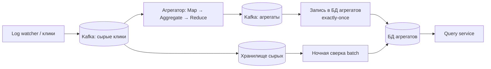

# Глава 6. Ad Click Event Aggregation

> **Статус:** 🟨 конспект (по памяти, сверь цифры с книгой)  
> 🎮 [Симулятор этой главы](../../simulator/index.html#ch6)

## 🎯 Одной фразой
Собираем клики по рекламе, агрегируем их по объявлениям и минутам почти в реальном времени и **точно**, потому что от счёта зависят деньги.

## 🧭 Карта решения
Требования → оценка (~10 тыс. QPS, пик ×5) → что храним (сырые + агрегаты) → **Kafka → stream-агрегация → хранилище агрегатов** → окна и **поздние события** → **exactly-once** → hot ad → отказоустойчивость → **сверка**

**Сюжет главы:** скорость второстепенна, главное **корректность**: нельзя потерять, задвоить и неверно разнести клики. Каждый шаг закрывает один из способов ошибиться.

## 1. Требования и оценка
- Агрегат кликов по `ad_id` за последние M минут; топ-100 самых кликаемых за минуту; фильтры (страна, ip и т. д.).
- Корректность важнее скорости; учёт опоздавших и дублей; восстановление после сбоя за минуты.
- ~1 млрд кликов в сутки → ≈ **10 тыс. QPS в среднем, пик ≈ 50 тыс.**; ~100 ГБ в сутки.

## 2. Данные: храним и сырое, и агрегаты
- **Сырые** клики (`ad_id, время, user_id, ip, country`) нужны для сверки и пересчёта; большая запись → Cassandra и подобное.
- **Агрегаты** (`ad_id, минута, фильтр, count`) то, что читают отчёты. Маленькая таблица с быстрыми запросами.

## 3. Архитектура

## 4. Путь решения: проблема → решение → эффект

### Шаг 1. Отчёты по сырым данным слишком медленные
- **🔴 Проблема:** `SELECT COUNT … GROUP BY` по миллиардам строк.
- **🟢 Решение:** **потоковая агрегация**: клики летят в **Kafka**, агрегатор сворачивает их в счётчики «объявление × минута» (DAG: **Map** разбирает и маршрутизирует по ad_id, **Aggregate** считает окно, **Reduce** сливает).
- **📈 Что улучшилось:** запросы читают маленькую таблицу: быстрее на порядки. Kafka сглаживает пики и позволяет перечитать данные.
- **⚖️ Цена:** потоковая система и новые типы ошибок (окна, поздние события, дубли).
- **🗣️ Для интервью:** «Считаем заранее в потоке, а не на запросе».

### Шаг 2. Какое время считать и как закрывать окно
- **🔴 Проблема:** клик может дойти с опозданием; по времени обработки (processing time) он попадёт не в ту минуту.
- **🟢 Решение:** агрегировать по **event time** (время клика), использовать **watermark**: окно закрывается не сразу, а через небольшую задержку. Окна: tumbling (минутные корзины), sliding (последние M минут).
- **📈 Эффект:** почти все опоздавшие учтены правильно.
- **⚖️ Цена:** больше ожидание, значит выше точность и больше задержка отчёта. Совсем поздние события добирает ночная сверка.

### Шаг 3. Ровно один раз
- **🔴 Проблема:** падение агрегатора и перечитывание данных ведёт к дублям; потеря ведёт к недосчёту. Для денег недопустимо.
- **🟢 Решение:** сочетание offset и записи результата делают **атомарной** (распределённая транзакция/идемпотентная запись) или используют идемпотентные записи и транзакции Kafka.
- **📈 Эффект:** каждый клик учтён ровно один раз.
- **⚖️ Цена:** медленнее и сложнее. Для лайков это перебор, для биллинга обязательно.

### Шаг 4. «Горячее» объявление
- **🔴 Проблема:** один ad_id получает огромную долю кликов, и его партиция перегружена.
- **🟢 Решение:** добавить **соль** к ключу (разные части одного ad_id считают разные узлы) с последующим слиянием, либо больше узлов под горячие ключи.
- **⚖️ Цена:** сложнее маршрутизация и слияние.

### Шаг 5. Отказоустойчивость и сверка
- **🔴 Проблема:** агрегатор упал: перечитывать часы данных долго; в потоке могли быть ошибки.
- **🟢 Решение:** периодические **снапшоты состояния** (счётчики и offset) для быстрого восстановления; **ночная batch-сверка** сырых данных с агрегатами (Lambda: поток + пакет; Kappa: всё потоком).
- **📈 Эффект:** восстановление за минуты и страховка от ошибок.
- **⚖️ Цена:** две реализации логики (поток и пакет), расхождения нужно разбирать.

## 5. Паттерны
Stream processing · Event time + watermark · Exactly-once / идемпотентность · Hot key salting · Checkpoint · Lambda vs Kappa · Reconciliation

## 6. Вопросы для повторения

Зачем хранить и сырые клики, и агрегаты?

Агрегаты для быстрых отчётов, сырые для сверки и пересчёта при ошибках.

Чем event time отличается от processing time?

Event time время самого клика, processing time время обработки. Опоздавшие клики при processing time попадут не в ту минуту.

Что такое watermark и какой в нём компромисс?

Задержка закрытия окна для опоздавших: больше задержка значит выше точность, но позже отчёт.

Как добиться exactly-once?

Атомарно связать запись агрегата и offset (транзакция) либо сделать запись идемпотентной.

Что делать с горячим ad_id?

Соль в ключе и предагрегация частями с последующим слиянием.

## 7. Мои заметки
- …
