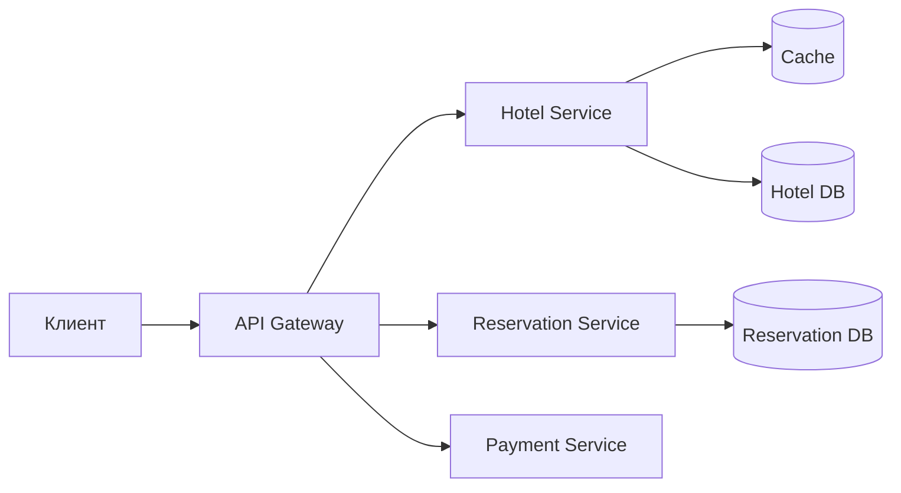

# Глава 7. Hotel Reservation System

> **Статус:** 🟨 черновик-образец  
> ⚠️ Написано по памяти как пример формата. **Сверь цифры и детали с книгой** и поправь своими словами.

## 🎯 Одной фразой
Система бронирования отелей, как Booking или Marriott. Главная сложность: **не продать один и тот же номер дважды**, когда в систему одновременно приходят много людей и повторные клики.

## 🧭 Карта решения (шаги)
1. Требования → 2. Оценка нагрузки (**вывод: нагрузка на запись маленькая**) → 3. API → 4. Модель данных (реляционная БД) → 5. Базовая архитектура → 6. **Конкурентность** (главная тема) → 7. Масштабирование → 8. Согласованность между микросервисами

**Сюжет главы:** нагрузка небольшая, поэтому сложность не в объёме, а в корректности. Чтобы не получить двойное бронирование, берём ACID-базу и аккуратно обрабатываем конкурентные запросы. Когда система растёт, возникает новая проблема: данные разъезжаются по сервисам.

## 1. Требования
- **Функциональные:** посмотреть отели и номера, забронировать номер, отменить бронь, админка отеля. Допускается **овербукинг ~10%** (отели сами так делают, потому что часть броней отменяется).
- **Нефункциональные:**
  - **Корректность важнее скорости:** двойное бронирование недопустимо.
  - Высокая конкурентность в пиковые даты.
  - Умеренная задержка: пользователь готов подождать при бронировании, но не при просмотре.

## 2. Оценка нагрузки
Исходные данные: 5000 отелей, около 1 млн номеров, заполняемость 70%, средний срок брони 3 дня.
- Бронирований в день ≈ 1M × 0.7 / 3 ≈ **240 тыс./день ≈ 3 TPS**.
- Воронка пользователя: просмотр отеля → страница бронирования → подтверждение. На каждом шаге отваливается ~90%. Получается примерно **300 / 30 / 3 QPS**.

**Вывод:** запись (3 TPS) ничтожна. Шардировать ради нагрузки не нужно, одна реляционная БД справится. Сложность будет не в масштабе, а в конкурентности.

## 3. API и модель данных
Ключевые эндпоинты: `GET /hotels/{id}`, `GET /hotels/{id}/rooms?checkin&checkout`, `POST /reservations`, `DELETE /reservations/{id}`.

**Почему реляционная БД (например, MySQL/PostgreSQL)?**
- Нагрузка read-heavy, а запись небольшая.
- Нужны **ACID-транзакции**: деньги и «один номер, одна бронь».
- Данные чётко структурированы, нужны JOIN'ы.

Главная идея модели: храним **не конкретные номера, а инвентарь по типу и дате** (`room_type_inventory`).

| Таблица | Ключевые поля | Зачем |
|---|---|---|
| `room_type_inventory` | `hotel_id, room_type_id, date, total_inventory, total_reserved` | Сколько номеров типа продано на дату. Основа проверки «есть ли места». |
| `reservation` | `reservation_id, hotel_id, room_type_id, start_date, end_date, status, guest_id` | Статусы: pending → paid → refunded / canceled / rejected. |

## 4. Архитектура

Просмотр отелей читает в основном статичные данные (кэшируем). Бронирование проходит через Reservation Service, который и защищает целостность инвентаря.

## 5. Путь решения: проблема → решение → эффект

### Шаг 1. Пользователь дважды нажал «Забронировать»
- **🔴 Проблема:** двойной клик или повторный запрос после таймаута создаёт две брони (и два списания денег).
- **🟢 Решение:** **идемпотентность**. `reservation_id` генерируется при открытии страницы бронирования и становится первичным ключом. Повторный `INSERT` с тем же ключом падает по unique constraint.
- **📈 Что улучшилось:** надёжность. Повтор запроса безопасен, и клиент может ретраить без риска.
- **⚖️ Цена:** клиент должен получить id заранее, плюс обработка ошибки «уже существует».
- **🔀 Альтернативы:** отключать кнопку на клиенте (ненадёжно, это лишь UX), дедупликация по времени (хрупко).
- **🗣️ Для интервью:** «ID брони создаём заранее и делаем его уникальным ключом, поэтому повтор того же запроса не создаст дубль».

### Шаг 2. Двое одновременно бронируют последний номер
- **🔴 Проблема (гонка):** оба прочитали `total_reserved = 99 из 100`, оба решили «есть место», оба записали. Итог: 101.
- **🟢 Решение (варианты):**
  1. **Пессимистичная блокировка** (`SELECT … FOR UPDATE`): строку блокируем, второй ждёт.
  2. **Оптимистичная блокировка:** в строке есть `version`. Обновляем с условием `WHERE version = X`, при конфликте повторяем.
  3. **Ограничение в БД:** `CHECK (total_reserved <= total_inventory * 1.1)`. БД сама не даст нарушить правило.
- **📈 Что улучшилось:** корректность. Гарантированно нет перепродажи сверх лимита.
- **⚖️ Цена и сравнение:**
  - Пессимистичная: надёжно, но блокировки замедляют и дают риск deadlock'ов. Подходит, когда конфликтов много.
  - Оптимистичная: быстрая без блокировок, но при частых конфликтах много ретраев. Подходит, когда конфликтов мало (**наш случай: низкий QPS**).
  - DB constraint: просто и надёжно, но логика живёт в БД, и не все СУБД это удобно поддерживают.
- **🗣️ Для интервью:** «Так как конфликтов мало, оптимистичная блокировка или constraint в БД подойдут лучше, чем дорогие блокировки».

### Шаг 3. Нужно масштабироваться
- **🔴 Проблема:** один инстанс БД рано или поздно станет узким местом, и это единая точка отказа.
- **🟢 Решение:** **шардирование по `hotel_id`** (все данные отеля лежат в одном шарде, поэтому транзакция бронирования не распределённая), плюс **кэш инвентаря** (Redis).
  - Кэш хранит доступность на будущие даты. БД остаётся источником истины. Проверка при бронировании идёт **в БД**, а не по кэшу.
  - Рассинхрон кэша и БД допустим, потому что кэш нужен только для отображения. Для синхронизации используют **CDC**.
- **📈 Что улучшилось:** пропускная способность чтения и отказоустойчивость.
- **⚖️ Цена:** кэш может показать устаревшую доступность. Пользователь увидит «есть номер», а при брони получит отказ. Это терпимо, а перепродажа нет.
- **🔀 Альтернативы:** шардировать по дате (хуже: бронь на несколько дат размазывается по шардам).
- **🗣️ Для интервью:** «Кэш для скорости чтения, а решающая проверка всегда в БД. Шардируем по отелю, чтобы бронь не стала распределённой транзакцией».

### Шаг 4. Микросервисы: данные в разных БД
- **🔴 Проблема:** Reservation, Payment и Hotel живут в разных БД, и одной ACID-транзакции на всех уже нет. Если оплата прошла, а запись брони упала, получается рассинхрон.
- **🟢 Решение:** распределённые транзакции. Варианты:
  - **2PC:** строгая согласованность, но медленно, и координатор становится слабым местом.
  - **TC/C (Try-Confirm/Cancel):** сначала резервируем (Try), потом подтверждаем или откатываем.
  - **Saga:** цепочка локальных транзакций, а при ошибке запускаются компенсирующие действия (например, возврат денег).
- **📈 Что улучшилось:** согласованность между сервисами без общей БД.
- **⚖️ Цена:** сложность. Нужно думать об идемпотентности и порядке компенсаций, и согласованность становится «в итоге».
- **🗣️ Для интервью:** «Саги или TC/C, потому что 2PC слишком тяжёлый. Все шаги идемпотентны».

## 6. Паттерны из этой главы
Идемпотентность · Оптимистичные/пессимистичные блокировки · Шардирование · Кэш + CDC · Saga / TC/C / 2PC (все в `cheatsheets/`)

## 7. Вопросы для повторения

Почему в этой главе не нужно шардировать ради нагрузки?

Запись всего около 3 TPS, чтение умеренное. Шардирование нужно только для отказоустойчивости и роста в будущем.

Как защититься от двойного клика на «Забронировать»?

Идемпотентность: `reservation_id` создаётся заранее и является уникальным ключом, поэтому повторный INSERT упадёт.

Чем оптимистичная блокировка отличается от пессимистичной и когда что выбирать?

Пессимистичная блокирует строку заранее (подходит при частых конфликтах). Оптимистичная проверяет версию при записи и ретраит (подходит при редких конфликтах, как у нас).

Почему проверку доступности при бронировании нельзя делать по кэшу?

Кэш может быть устаревшим, и это приведёт к перепродаже. Решающая проверка идёт в БД.

Почему шардируем по hotel_id, а не по дате?

Бронь привязана к одному отелю, поэтому транзакция остаётся в одном шарде. По дате она размазалась бы по нескольким.

Зачем нужны Saga/TC/C вместо 2PC?

2PC медленный и зависит от координатора. Saga и TC/C легче, но требуют идемпотентности и компенсаций.

## 8. Мои заметки
- …
