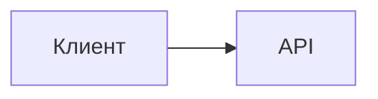

# Глава 13. Stock Exchange

> **Статус:** ⬜ не начата · 🟨 конспект · 🟩 повторена  
> **Дата прохождения:** …  **Повторения:** …

## 🎯 Одной фразой
Что мы строим: биржа, матчинг заявок. Если через месяц прочитаешь только эту строку, должно стать понятно, о чём глава.

## 🧭 Карта решения (шаги)
Короткий список этапов, из которых сложился дизайн. Это «скелет рассказа» для интервью.
1. Требования → 2. Оценка нагрузки → 3. API → 4. Модель данных → 5. Базовая архитектура → 6. Узкие места → 7. Углубление → 8. Масштабирование

## 1. Требования
- **Функциональные:** …
- **Нефункциональные:** …
- **Что явно не делаем (и почему):** …

## 2. Оценка нагрузки
Расчёт + **вывод**: что эти цифры значат для архитектуры (например, «3 TPS на запись → шардирование не нужно»).

## 3. API и модель данных
Эндпоинты, таблицы. **Почему такая БД / такая схема?**

## 4. Архитектура

Объяснение словами: путь запроса, роль каждого компонента.

## 5. Путь решения: проблема → решение → эффект
Главный раздел. Каждое решение оформляем одинаково.

### Шаг N. Название проблемы
- **🔴 Проблема:** что ломается или тормозит, при каких условиях.
- **🟢 Решение:** что сделали.
- **📈 Что улучшилось:** конкретно, какое свойство системы (надёжность, скорость, согласованность…).
- **⚖️ Цена / компромисс:** чем заплатили.
- **🔀 Альтернативы:** что ещё можно было и почему не выбрали.
- **🗣️ Фраза для интервью:** как это сказать за 20 секунд.

## 6. Паттерны из этой главы
Ссылки на `cheatsheets/…`

## 7. Вопросы для повторения

Вопрос?

Ответ.

## 8. Мои заметки
Что было непонятно, что хочу перечитать в книге.
